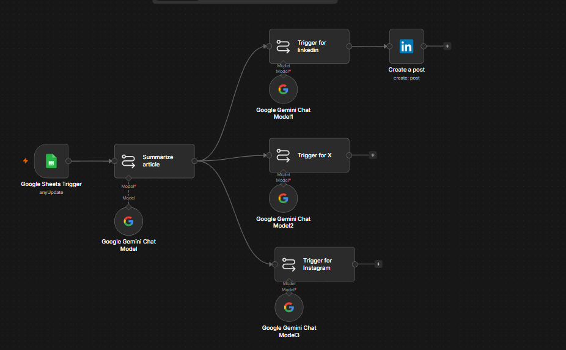

# AI-Powered Social Media Content Automation

An event-driven automation pipeline built in [n8n](https://n8n.io) that turns a new article link into platform-tailored social media posts — automatically.

## What it does

1. **Trigger:** A new row added to a Google Sheet (containing an article link) triggers the workflow.
2. **Summarize:** Google Gemini reads the article and produces a structured summary — key insights, actionable tips, tone, and audience implications.
3. **Branch & Adapt:** The summary is passed in parallel to three separate Gemini-powered chains, each with a platform-specific prompt:
   - **LinkedIn:** Professional, analysis-driven post with a call to action.
   - **X (Twitter):** Punchy, under-30-word post with a discussion hook.
   - **Instagram:** Adapted for visual/caption-style content.
4. **Publish:** Finished posts are sent to each platform's API for publishing.

## Architecture

```
Google Sheets Trigger
        │
        ▼
  Summarize Article (Gemini)
        │
   ┌────┼────┐
   ▼    ▼    ▼
LinkedIn  X  Instagram
 Prompt Prompt Prompt
 (Gemini)(Gemini)(Gemini)
   │    │    │
   ▼    ▼    ▼
 Post  Post  Post
```

## Tools & APIs used

- **n8n** — workflow orchestration
- **Google Sheets API** — trigger source
- **Google Gemini API** — content summarization and platform-specific generation
- **LinkedIn API** — automated post creation
- **X (Twitter) API** — automated post creation
- **Instagram API** — automated post creation

## Why separate LLM nodes per platform?

Each platform has distinct tone, length, and audience expectations (e.g. X posts are capped at ~30 words and hook-driven, while LinkedIn favors longer, analytical posts). Using a dedicated Gemini chain per platform, each with its own tailored prompt, produces higher-quality, platform-native content compared to a single generic post reused everywhere.

## Setup

1. Import `workflow.json` into your n8n instance.
2. Connect your own credentials for:
   - Google Sheets (OAuth2)
   - Google Gemini API
   - LinkedIn, X, and Instagram (OAuth2 / API keys)
3. Replace the placeholder Google Sheet ID with your own sheet's ID.
4. Activate the workflow.

## Screenshot



---
*Built as a personal project to explore event-driven automation, LLM-based content adaptation, and multi-platform API integration.*
